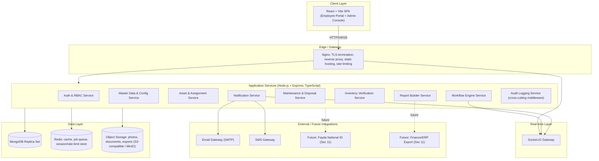
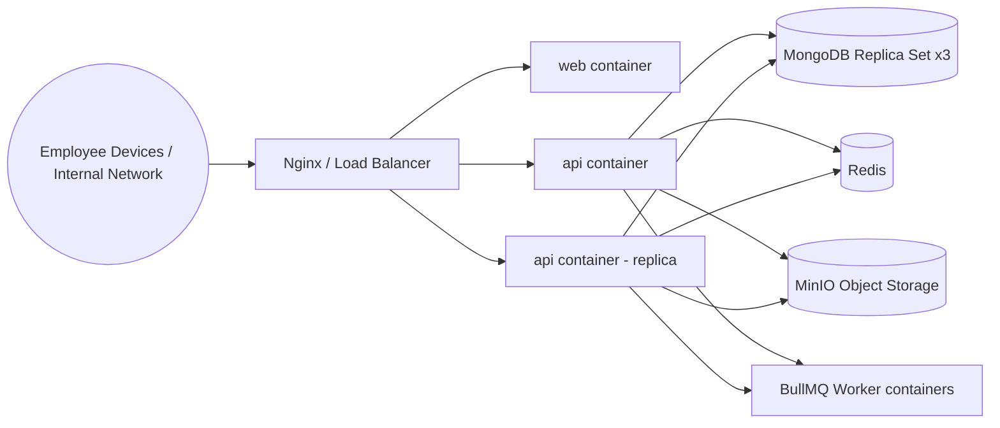

# ADDIS MESOB — DYNAMIC PROPERTY MANAGEMENT SYSTEM (AM-PMS)
## Full-Stack System Design & AI Build Specification

| | |
|---|---|
| **Document Ref** | AM-PMS-SDD-001 |
| **Version** | 1.0 |
| **Source Requirements** | AM-PMS-SRS-001 v1.0 (17-Jul-2026) |
| **Prepared For** | ICT & Property Administration Directorate, Addis Mesob One Stop Government Service Center |
| **Prepared By** | System Design & AI Build Team |
| **Audience** | Human reviewers (ICT, Property Admin, Finance, Audit) **and** AI coding agents (Claude Code, GitHub Copilot, OpenAI Codex, Google Antigravity) |
| **Purpose of this document** | This is a self-contained build specification. An AI coding agent should be able to read this document top-to-bottom and generate a working, production-grade codebase without needing to re-derive requirements, architecture, schema, or UI decisions. Every place where the source SRS was silent or ambiguous, a decision has been made explicitly and flagged as **[DESIGN DECISION]** so the build stays unblocked. |

---

## How to Use This Document (read this first — especially if you are an AI agent)

1. **Section 0** explains the organizational context and why the visual design looks the way it does. Do not skip it — it drives every UI decision in Section 5.
2. **Section 1–3** are the non-negotiable functional contract, traced back to the SRS requirement IDs (`FR-*`, `NFR-*`). Every screen and endpoint you build must map to one of these IDs.
3. **Section 4** is the system architecture — follow it exactly for folder structure, service boundaries, and data flow.
4. **Section 5** is the design system — use the exact tokens (colors, spacing, type scale, components) given. Do not invent new colors or fonts.
5. **Section 6** is the full data model — implement schemas exactly as specified, they are already normalized against the SRS Section 9 collections.
6. **Section 7** is the API contract — implement every endpoint listed; do not rename routes.
7. **Section 8** is the workflow-engine design — this is the hardest subsystem; read it twice before coding.
8. **Section 9–11** cover security, non-functional targets, and DevOps/deployment.
9. **Section 12** is the **AI Agent Build Plan** — a phase-by-phase task breakdown assigning work to specific tools (Claude Code / Copilot / Codex / Antigravity) according to their strengths. **Follow this sequence.** Do not build the workflow engine before master data. Do not build the UI before the API contract is implemented and tested.
10. **Section 13** is Definition of Done / acceptance criteria per phase — use it as your own checklist before marking a phase complete.
11. **Section 14** is open risks and questions that still need a human decision — flag these back to the ICT Directorate rather than guessing silently.

---

# 0. Organizational Research & Brand Context

This section documents research into Addis Mesob's real-world identity, conducted specifically to ground the UI/UX decisions in Section 5. AM-PMS is an **internal, back-office system** (property/asset management for staff), not the public-facing citizen portal — but because Addis Mesob employees already use the citizen-facing Mesob platforms daily, AM-PMS should feel like a natural sibling product, not a foreign enterprise tool bolted on top.

### 0.1 What Addis Mesob is

- Addis Mesob (Amharic: **መሶብ**, "Mesob") is Ethiopia's flagship **One-Stop Digital Government Service Center** program. The name is deliberately symbolic: a *mesob* is the traditional woven Ethiopian basket/table used to serve injera and many dishes together — publicly described by government communications as a metaphor for **many services, one place**.
- The national platform is formally branded **MESOB — "Modern Ethiopian Service for Organised Benefits"**, run in partnership with Ethiopia's **Fayda National Digital ID** program (`id.gov.et`), and powered by a **"MESOB Bridge API Gateway"** that connects participating institutions in real time.
- Physically, Mesob centers are large, modern, multi-story service halls (dozens of service windows per branch — one branch profiled has 96 windows across 22 institutions) that have been rolled out across Addis Ababa's sub-cities and are expanding nationally.
- Its public messaging consistently emphasizes: **modern, digital, efficient, transparent, citizen-centered, dignified, less bureaucracy**, and pride in Ethiopian identity ("designed for Ethiopia, inspired by global best practice").

### 0.2 Digital presence and interface conventions observed

- The parent Fayda/MESOB web presence (`id.gov.et`) is a **modern Next.js-built, component-driven site** with a clean institutional layout: top navigation bar, hero section, feature-icon grid, partner-logo strip, image gallery, footer with social + legal links — and notably **includes a light/dark theme toggle**, signaling that Ethiopian govtech platforms in this family are expected to support modern UI conventions, not legacy government-portal aesthetics.
- Iconography is simple line/flat icons (checkmark, laptop, document, flag, database) rather than illustrations — favor **clarity over decoration**.
- Partner/institution branding is displayed as a **logo wall**, implying AM-PMS should support a similar "branch/department" visual identity model (e.g., showing which of the 20+ partner institutions or branches an asset/request belongs to).
- No public, downloadable brand/color guideline (PDF) was found at the time of writing. **[DESIGN DECISION]** In the absence of an official hex-code palette, this document defines a palette that is (a) consistent with the sober blue/teal govtech tone used by Fayda-family digital products, (b) respectful of the Ethiopian national palette (green–yellow–red) used only as *sparing accent*, never as dominant UI color (avoids looking like a flag rather than a professional tool), and (c) fully token-based so the real Addis Mesob brand team can swap exact hex values later with zero code changes (see §5.2, CSS variables). This is flagged for confirmation in §14.

### 0.3 Design implications for AM-PMS

| Observation | Implication for AM-PMS UI |
|---|---|
| Public Mesob brand = modern, digital-first, trustworthy | AM-PMS must look like enterprise SaaS (Linear/Notion-grade polish), not a legacy government intranet |
| Many institutions/branches under one roof | Strong branch/department switcher pattern; every screen shows current org context |
| Bilingual by mandate (Amharic/English) | UI must be built with i18n from day one, not retrofitted; layout must tolerate Amharic script (Ge'ez) line-height/width differences |
| Physical centers = high foot traffic, many staff, shared kiosks | Fast, keyboard- and scanner-friendly UI; large touch targets for shared/tablet devices; quick logout; low cognitive load |
| Emphasis on transparency & anti-corruption | Every mutating action visibly tied to audit trail in the UI, not just the database — builds staff trust and deters misuse |
| National ID (Fayda) integration culture | Design employee identity and future integrations (Section 11 of SRS) assuming a Fayda-style national ID connector may arrive later — keep identity provider abstracted (see §9.1) |

---

# 1. Product Summary (recap)

AM-PMS is an internal, metadata-driven, web-based platform for Addis Mesob's **ICT & Property Administration Directorate** to manage the complete lifecycle of movable/immovable property — registration → assignment → transfer → maintenance → inventory verification → disposal — with a self-service portal for every employee, configurable approval workflows, and a no-code report builder, fully auditable.

**Primary users:** hundreds of employees across multiple branches (per SRS §2.3): Employees, Property Officers, Store Keepers, Managers, Finance, Auditors, ICT Admins, Super Admins.

**Explicitly out of scope for v1** (per SRS §1.2): payroll/HR core, general-ledger posting, upstream procurement/tendering.

---

# 2. Requirements Traceability Matrix (summary)

Every module below is implemented **only** when its source requirement IDs are satisfied. Full requirement text is in the SRS; this table is the build checklist.

| Module | Source Req. IDs | Priority | Build Phase |
|---|---|---|---|
| Auth & RBAC | FR-AUTH-01→09, NFR-SEC-01→10 | P0 | Phase 1 |
| Master Data & Config Console | FR-MD-01→06 | P0 | Phase 2 |
| Custom Fields Engine | FR-CF-01→06 | P0 | Phase 2 |
| Asset Registration & Bulk Import | FR-REG-01→06 | P0 | Phase 3 |
| Assignment / Transfer / Return | FR-ASG-01→06 | P0 | Phase 3 |
| Employee Self-Service Portal | FR-ESS-01→08 | P0 | Phase 4 |
| Workflow Engine | FR-WF-01→07 | P0 | Phase 5 |
| Maintenance & Disposal | FR-MNT-01→08 | P1 | Phase 5 |
| Inventory Verification | FR-INV-01→05 | P1 | Phase 5 |
| Notifications | FR-NTF-01→05 | P1 | Phase 6 |
| Dashboards | FR-DSH-01→04 | P1 | Phase 7 |
| Report Builder | FR-RPT-01→05 | P1 | Phase 6 |
| Audit Logs | FR-AUD-01→05 | P0 (cross-cutting) | Phase 1 (foundation), enforced everywhere |
| API-First Layer | FR-API-01→04 | P0 (cross-cutting) | Phase 1 (foundation) |

---

# 3. Roles & Permission Model (concrete RBAC matrix for build)

Expands SRS §3 into an implementable permission set. Permissions follow the `module.action` convention mandated by FR-AUTH-06.

| Role | Key Permissions (`module.action`) | Scope |
|---|---|---|
| `employee` | `request.create.own`, `request.view.own`, `asset.view.assigned`, `asset.accept`, `asset.return.request`, `asset.report_issue`, `history.view.own` | self |
| `property_officer` | all `employee` perms + `asset.*`, `assignment.*`, `transfer.*`, `inventory.conduct`, `masterdata.edit.branch_scope`, `maintenance.log` | branch/department |
| `store_keeper` | `asset.receive`, `asset.dispatch`, `inventory.assist`, `asset.view` | store/branch |
| `manager` | `request.approve`, `asset.view.team`, `report.view.department` | department |
| `finance` | `disposal.approve`, `maintenance.cost.approve`, `report.view.org`, `asset.value.edit` | organization |
| `auditor` | `*.view` (read-only, org-wide), `auditlog.view.full` | organization, read-only |
| `ict_admin` | `masterdata.*`, `customfield.*`, `workflow.*`, `user.manage`, `notification.config` | organization |
| `super_admin` | all permissions, including `role.manage`, `system.config` | organization |

**[DESIGN DECISION]** Roles are stored as data (per FR-AUTH-06/07), and this table is the **seed data**, not a hard-coded enum — administrators can create additional roles later without a deploy.

---

# 4. System Architecture

### 4.1 Architecture style
**Layered, API-first, modular monolith at launch, service-splittable later.** A modular monolith (not microservices) is the correct choice for this scale (hundreds of internal users, one deployment target, on-prem/private-cloud constraint per SRS §2.4/2.5) — microservices would add operational overhead with no benefit here, and would work against the "no code deployment for config changes" and "AI-buildable in defined phases" goals. Each module is still built as an isolated, independently testable domain package so it *could* be extracted later.

### 4.2 High-level component diagram



### 4.3 Layer responsibilities (maps to SRS §12.1)

| Layer | Tech | Responsibility |
|---|---|---|
| Presentation | React 18 + Vite + TypeScript + Tailwind CSS + shadcn/ui | Renders dynamic, metadata-driven forms/dashboards; near-zero business logic client-side |
| Edge | Nginx | TLS termination, HTTP→HTTPS redirect, reverse proxy, gzip/br compression, static asset caching, coarse rate limiting |
| Application | Node.js 20 LTS + Express + TypeScript | REST API, RBAC enforcement, business rules, workflow evaluation |
| Real-time | Socket.IO (Redis adapter for horizontal scale) | Live notifications, dashboard ticks, workflow status pushes |
| Data access | Mongoose (schema validation) + native driver for aggregation pipelines | Schema-validated writes; complex report aggregations |
| Data store | MongoDB 7 (replica set, 3 nodes min for production) | Primary datastore — document model fits metadata-driven entities |
| Cache/Queue | Redis 7 | Session/rate-limit store, BullMQ job queue (notifications, report generation, escalations) |
| Object storage | MinIO (self-hosted S3-compatible) or S3 | Asset photos, attachments, generated report exports |
| Containerization | Docker + Docker Compose (dev/small) / Docker Swarm or k3s (multi-branch prod) | Portable, on-prem-capable deployment per SRS §2.4/2.5 |

### 4.4 Monorepo folder structure (authoritative — AI agents must follow this exactly)

```
am-pms/
├── server/                           # Express backend
│   ├── src/
│   │   ├── modules/
│   │   │   ├── auth/
│   │   │   ├── masterdata/
│   │   │   ├── customfields/
│   │   │   ├── assets/
│   │   │   ├── assignments/
│   │   │   ├── maintenance/
│   │   │   ├── disposal/
│   │   │   ├── inventory/
│   │   │   ├── workflow/
│   │   │   ├── notifications/
│   │   │   ├── dashboards/
│   │   │   ├── reports/
│   │   │   └── audit/            # cross-cutting: middleware + service
│   │   ├── common/
│   │   │   ├── middleware/       # auth guard, rbac guard, error handler, audit interceptor
│   │   │   ├── validators/       # Zod schemas shared per module
│   │   │   ├── utils/
│   │   │   └── config/
│   │   ├── sockets/
│   │   ├── jobs/                 # BullMQ workers (notifications, escalations, exports)
│   │   ├── app.ts
│   │   └── server.ts
│   ├── test/                     # Jest + Supertest
│   └── package.json
├── client/                           # React SPA
│   ├── src/
│   │   ├── modules/              # mirrors API modules 1:1
│   │   ├── design-system/        # tokens, primitives, shared components (Section 5)
│   │   ├── layouts/              # PortalLayout, AdminLayout, AuthLayout
│   │   ├── routes/
│   │   ├── lib/                  # api client, i18n, rbac helpers
│   │   ├── store/                # state management
│   │   └── main.tsx
│   ├── test/                     # Vitest + Testing Library, Playwright e2e in /e2e
│   └── package.json
├── packages/
│   ├── shared-types/                  # TypeScript types/interfaces shared FE↔BE (single source of truth)
│   ├── shared-constants/              # permission strings, status enums, event names
│   └── config/                        # eslint, tsconfig, prettier base configs
├── infra/
│   ├── docker/
│   │   ├── api.Dockerfile
│   │   ├── web.Dockerfile
│   │   └── nginx.conf
│   ├── docker-compose.dev.yml
│   ├── docker-compose.prod.yml
│   └── k8s/ (optional, Phase 9+)
├── docs/
│   ├── AM-PMS_System_Design_Document_v1.0.md   # this file
│   ├── api/                           # OpenAPI/Swagger spec (generated + committed)
│   └── adr/                           # Architecture Decision Records
├── .github/workflows/                 # CI pipelines
├── package.json                       # workspaces root
└── README.md
```

**[DESIGN DECISION]** A TypeScript monorepo (npm/pnpm workspaces) was chosen over separate repos so `shared-types` guarantees the frontend and backend never drift — critical when AI agents are generating both sides in parallel across different tools.

---

# 5. Design System (UI/UX) — "Mesob Workspace" visual language

Design principle, informed by §0: **modern government SaaS, not legacy government intranet.** Think Linear/Notion/Vercel-grade polish, applied to a civic-institution tone — calm, trustworthy, fast, bilingual, and legible at a glance across hundreds of shared workstation and tablet users.

### 5.1 Design principles

1. **Clarity over decoration** — every screen answers "what do I need to do right now" in under 3 seconds.
2. **Status is always visible** — asset/request state uses consistent color-coded badges everywhere (list, detail, dashboard).
3. **Three-click rule** — no self-service action (per SRS §6.2) takes more than 3 steps.
4. **Bilingual-native, not bilingual-patched** — every string goes through the i18n layer from the first commit; layouts tested in both English and Amharic (Ge'ez script runs ~15–20% wider/taller per line — never hard-code container widths around English string length).
5. **Dense but breathable** — property officers and store keepers process high transaction volume; avoid the airy "marketing SaaS" whitespace excess. Use compact table density by default, comfortable density for the employee self-service portal.
6. **Accessible by default** — WCAG 2.1 AA minimum: 4.5:1 text contrast, full keyboard navigation, visible focus states.

### 5.2 Color tokens

**[DESIGN DECISION — flag for brand confirmation, see §14]** No official Addis Mesob digital brand guideline was publicly available. The palette below is a professional govtech palette in the tonal family used by Ethiopia's Fayda/MESOB digital properties, implemented **entirely as CSS custom properties / Tailwind theme tokens** so the true brand team can swap exact hex values later with zero code changes.

```css
:root {
  /* Brand */
  --am-primary-50:  #eef6ff;
  --am-primary-100: #d9ecff;
  --am-primary-300: #7ab8f5;
  --am-primary-500: #1668c1;   /* primary brand blue — trust, government, digital ID lineage */
  --am-primary-600: #10529b;
  --am-primary-700: #0b3d75;
  --am-primary-900: #062347;

  --am-accent-500:  #0ea88c;   /* teal-green accent — "digital service", growth, positive action */
  --am-accent-700:  #076b58;

  /* Ethiopian identity — used ONLY as sparing accent (badges, small brand marks), never as dominant surface color */
  --am-heritage-green:  #078930;
  --am-heritage-yellow: #fcdd09;
  --am-heritage-red:    #da121a;

  /* Neutrals */
  --am-gray-0:   #ffffff;
  --am-gray-50:  #f7f8fa;
  --am-gray-100: #eef0f3;
  --am-gray-200: #e1e4e9;
  --am-gray-400: #9aa2af;
  --am-gray-600: #5c6472;
  --am-gray-800: #2b303b;
  --am-gray-900: #171a21;

  /* Semantic status (asset lifecycle + workflow states, Section 7 of SRS) */
  --status-info:      #1668c1;  /* Purchase, Inventory */
  --status-neutral:   #5c6472;  /* Draft/unassigned */
  --status-available: #0ea88c;  /* Available */
  --status-pending:   #d69b1f;  /* Requested, Approved-pending, In Progress */
  --status-active:    #17824e;  /* Assigned, In Use */
  --status-warning:   #d97706;  /* Maintenance */
  --status-danger:    #da121a;  /* Rejected, Lost, Overdue */
  --status-terminal:  #6b7280;  /* Disposed, Closed */

  /* Dark mode surfaces (Fayda-family sites support theme toggle — AM-PMS must too) */
  --am-dark-bg:      #0f1319;
  --am-dark-surface: #171c24;
  --am-dark-border:  #262c37;
}
```

### 5.3 Typography

- **Latin/UI text:** `Inter` (variable font) — excellent legibility at small sizes for dense tables.
- **Amharic/Ge'ez text:** `Noto Sans Ethiopic` — pair with Inter via `font-family: Inter, "Noto Sans Ethiopic", system-ui, sans-serif;` so mixed strings render correctly without a FOUT.
- **Monospace (asset codes, IDs):** `JetBrains Mono`.
- Type scale (Tailwind-style): `text-xs 12/16` (meta/labels) → `text-sm 14/20` (body/table) → `text-base 16/24` (default) → `text-lg 18/28` → `text-xl 20/28` (section headers) → `text-2xl 24/32` (page titles) → `text-3xl 30/38` (dashboard KPIs).

### 5.4 Spacing, radius, elevation

- 4px base spacing scale (4/8/12/16/24/32/48/64).
- Border radius: `--radius-sm: 6px` (inputs, badges), `--radius-md: 10px` (cards), `--radius-lg: 16px` (modals, panels).
- Elevation via subtle shadows, not heavy drop-shadows: `0 1px 2px rgba(0,0,0,.04), 0 2px 8px rgba(0,0,0,.06)` for cards; a 1px `--am-gray-200` border does most of the separation work (flat, modern, not skeuomorphic).

### 5.5 Component library

Build on **shadcn/ui** (Radix primitives + Tailwind) — chosen because it ships accessible, unstyled primitives that are then themed with the tokens above, giving a fully custom look without owning low-level a11y logic. Required components:

- `Button` (primary/secondary/ghost/destructive, with loading state)
- `StatusBadge` (maps directly to the semantic status tokens in §5.2 and the lifecycle states in §7)
- `DataTable` (server-side pagination, column sort, sticky header, density toggle, bulk row select — this is the workhorse component; Property Officer/Store Keeper screens live in this component)
- `DynamicForm` — **the most important custom component in the system.** Renders form fields at runtime from `PropertyType.customFieldDefs` (FR-CF-04). Must support all field types in FR-CF-02 with client-side validation mirroring FR-CF-05.
- `WorkflowStepper` — visualizes an approval chain and current position (supports sequential/parallel/conditional per FR-WF-03)
- `AssetCard` (grid view for employee portal — photo, name, status badge, "Accept"/"Return" CTA)
- `CommandPalette` (Cmd/Ctrl+K global search — asset code, employee, request — critical for hundreds of daily users)
- `NotificationBell` (real-time via Socket.IO, unread count)
- `QRScanner` (camera-based scan for Inventory Verification, mobile browser)
- `LanguageSwitcher` (persistent, per SRS §6.2.4)
- `ThemeToggle` (light/dark, consistent with parent Fayda/MESOB site convention)

### 5.6 Layout patterns

- **Admin/Officer Console:** left sidebar nav (collapsible) + top bar (branch switcher, search, notifications, profile) + main content — standard enterprise SaaS shell.
- **Employee Self-Service Portal:** top nav only (simpler, mobile-first — per SRS §6.2.1, employees act from a phone during physical hand-over), card-based "My Assets" grid, large touch targets (min 44×44px).
- Both shells share the same design tokens and component library so switching between "my stuff" and "admin work" (for a Property Officer, who is also an employee) feels like one product, not two.

### 5.7 Iconography & imagery
Use **Lucide icons** (already available in the build toolchain) — simple line icons matching the flat, clear icon style observed on the Fayda/MESOB site (§0.2). Avoid stock photography inside the app; use icons + status color + real asset photos only.

---

# 6. Data Model (implementation-ready schema)

Expands SRS §9 into concrete Mongoose schemas. All collections include `createdAt`, `updatedAt`, `createdBy`, `updatedBy` (audit-friendly) unless noted.

### 6.1 Conventions
- All IDs are MongoDB ObjectIds; human-facing codes (asset codes, request numbers) are separate, auto-generated, configurable-format strings (FR-REG-02).
- Soft-delete only: every master-data collection uses `isActive: boolean` — hard deletes are blocked at the API layer per FR-MD-05.
- Every write-path repository call is wrapped by the **Audit Interceptor** (see §8.4) — schemas below do not repeat "log this" per field; it's structural, not per-collection.

### 6.2 Core schemas (abbreviated to key fields; full field-level validators live in `packages/shared-types`)

```ts
// User (auth/account) — FR-AUTH-*
User {
  _id, employeeRef: ObjectId(Employee),
  username, passwordHash, email,
  mfaEnabled: boolean, mfaSecret?: string,
  roles: [{ role: ObjectId(Role), scopeType: 'global'|'branch'|'department', scopeRef?: ObjectId }],
  isActive, isLocked, failedLoginAttempts, lastLoginAt,
  delegations: [{ role, fromUser, toUser, startDate, endDate }] // FR-AUTH-08
}

// Role — FR-AUTH-06
Role { _id, name, description, permissions: [string /* "module.action" */], isSystemRole }

// Employee — business identity (source of custodian truth)
Employee {
  _id, employeeCode, fullName, fullNameAm, email, phone,
  department: ObjectId(Department), branch: ObjectId(Branch),
  position, isActive
}

// Branch / Building / Floor / Room / Department — SRS 9.4–9.7
Branch { _id, name, nameAm, code, address, contact, isActive }
Building { _id, name, branch: ObjectId(Branch), floorsCount, isActive }
Floor { _id, name, building: ObjectId(Building), order, isActive }
Room { _id, name, floor: ObjectId(Floor), building, branch, capacity, purpose, isActive }
Department { _id, name, nameAm, code, parentDepartment?: ObjectId(Department), branch, isActive }

// Category / PropertyType / CustomField — Dynamic design core, Section 5 of SRS
Category { _id, name, nameAm, parentCategory?: ObjectId(Category), description, isActive, version }
PropertyType {
  _id, name, nameAm, category: ObjectId(Category), unitOfMeasure,
  defaultUsefulLifeMonths, customFieldDefs: [ObjectId(CustomField)],
  statusFlowOverride?: ObjectId(StatusFlow), // allows per-type lifecycle variance (Sec 7 baseline)
  isActive, version
}
CustomField {
  _id, propertyType: ObjectId(PropertyType), label, labelAm,
  dataType: 'text'|'number'|'date'|'boolean'|'single_select'|'multi_select'|'attachment',
  isRequired, isUnique, isSearchable, options?: [string], validationRule?: string,
  order, isActive
}
StatusFlow { _id, name, states: [{ key, label, labelAm, colorToken }], transitions: [{ from, to, allowedRoles: [string] }] } // FR-MD-03

// Asset — central transactional entity, SRS 9.11
Asset {
  _id, assetCode /* auto-gen, configurable format */, name,
  propertyType: ObjectId(PropertyType), category: ObjectId(Category),
  status: string /* must be valid per StatusFlow for its PropertyType */,
  currentCustodian?: { type: 'employee'|'department'|'room', ref: ObjectId },
  currentLocation: { branch, building?, floor?, room? },
  value: number, currency: string, purchaseDate, supplier: ObjectId(Supplier),
  warrantyExpiry?: date,
  customFieldValues: { [customFieldId]: any }, // validated against CustomField defs at write time
  photos: [{ url, caption }], documents: [{ url, label, type }],
  qrCode: string, barcodeFormat: string,
  bundleParent?: ObjectId(Asset), bundleChildren?: [ObjectId(Asset)], // FR-ASG-05
  isActive
}

// Assignment — SRS 9.12
Assignment {
  _id, asset: ObjectId(Asset),
  custodian: { type: 'employee'|'department'|'room', ref: ObjectId },
  assignedDate, acceptedDate?, returnedDate?,
  conditionAtAssignment, conditionAtReturn?, notes,
  status: 'pending_acceptance'|'active'|'returned'|'transferred',
  requestRef?: ObjectId(Request)
}

// Request — generic hub, SRS 9.13
Request {
  _id, requestNumber, requestType: ObjectId(RequestType),
  requestor: ObjectId(User), targetAsset?: ObjectId(Asset), targetPropertyType?: ObjectId(PropertyType),
  payload: object /* type-specific fields */,
  status: 'submitted'|'in_review'|'approved'|'rejected'|'returned_for_clarification'|'completed'|'cancelled',
  workflowInstance: ObjectId(WorkflowInstance)
}
RequestType { _id, name, module: 'assignment'|'transfer'|'maintenance'|'disposal'|'new_asset', workflowDefinition: ObjectId(WorkflowDefinition), isActive } // FR-MD-04

// Workflow — SRS 9.14, expanded in Section 8
WorkflowDefinition {
  _id, name, requestType: ObjectId(RequestType), version, isActive,
  steps: [{
    order, name, approverRule: { type: 'role'|'specific_user'|'manager_of_requestor', value: string },
    condition?: { field: string, operator: string, value: any }, // e.g. value > 50000 → Finance
    parallel: boolean, escalation: { afterHours: number, escalateTo: string } // FR-WF-04
  }]
}
WorkflowInstance {
  _id, definition: ObjectId(WorkflowDefinition), definitionVersion,
  request: ObjectId(Request), currentStepIndex,
  history: [{ step, actor, action: 'approve'|'reject'|'return', comment, timestamp }],
  status: 'in_progress'|'completed'|'rejected'
}

// Maintenance / Disposal — SRS 9.15, 9.17
Maintenance {
  _id, asset: ObjectId(Asset), reportedBy: ObjectId(User), issueDescription,
  status: 'reported'|'scheduled'|'in_progress'|'completed'|'cannot_repair',
  cost?: number, technicianOrVendor, scheduledDate?, completedDate?, requestRef?: ObjectId(Request)
}
Disposal {
  _id, asset: ObjectId(Asset), method: 'sale'|'donation'|'scrap'|'write_off',
  justification, approvals: [{ approver, role, decision, timestamp, comment }],
  proceeds?: number, disposalDate, requestRef: ObjectId(Request)
}

// InventorySession — SRS 9.16
InventorySession {
  _id, scope: { branch, room?, category? }, scheduledDate, conductedBy: [ObjectId(User)],
  scannedAssets: [{ asset, scannedAt, scannedBy, locationMatched: boolean }],
  variances: [{ asset, type: 'missing'|'unexpected'|'location_mismatch', resolution?: string, resolvedBy? }],
  status: 'scheduled'|'in_progress'|'closed', signOff?: { by, at, reportUrl }
}

// Supplier, Notification, AuditLog — SRS 9.18–9.20
Supplier { _id, name, contact, taxId, category, isActive }
Notification { _id, recipient: ObjectId(User), channel: 'in_app'|'email'|'sms', eventType, payload, status: 'queued'|'sent'|'failed'|'read', sentAt }
AuditLog { _id, actor: ObjectId(User), action, entityType, entityId, beforeValue?, afterValue?, timestamp, ipAddress, requestId }
// AuditLog collection is append-only at the DB layer: no application code path exposes update/delete (FR-AUD-04);
// enforced additionally via a MongoDB role with no update/delete grant on this collection.
```

### 6.3 Indexing plan (performance, NFR-PERF)
- `Asset`: compound index `{status, propertyType}`, text index on `{name, assetCode}`, index on `currentCustodian.ref`.
- `AuditLog`: compound `{entityType, entityId, timestamp}` and `{actor, timestamp}`.
- `Notification`: `{recipient, status, sentAt}`.
- `Request`/`WorkflowInstance`: `{status, requestType}`, `{requestor}`.

---

# 7. API Contract (REST, versioned `/api/v1`)

All endpoints require a valid JWT (FR-API-02) except `/auth/login` and `/auth/refresh`. All list endpoints support `?page&limit&sort&filter[...]`. All mutating endpoints are wrapped by the Audit Interceptor (§8.4). Full OpenAPI 3.1 spec is generated from the same Zod validators used at runtime (single source of truth) and committed to `docs/api/openapi.yaml` (FR-API-03).

| Domain | Key Endpoints |
|---|---|
| Auth | `POST /auth/login`, `POST /auth/refresh`, `POST /auth/logout`, `POST /auth/mfa/verify`, `GET /auth/me` |
| Users/Roles | `GET/POST/PATCH /users`, `GET/POST/PATCH /roles`, `POST /users/:id/delegate` |
| Master Data | `GET/POST/PATCH /branches`, `/buildings`, `/floors`, `/rooms`, `/departments`, `/categories`, `/property-types`, each with `/:id/deactivate` (never hard delete) |
| Custom Fields | `GET/POST/PATCH /property-types/:id/custom-fields` |
| Assets | `GET/POST/PATCH /assets`, `GET /assets/:id`, `POST /assets/bulk-import`, `GET /assets/bulk-import/:jobId/status`, `POST /assets/:id/photos`, `GET /assets/:id/qr` |
| Assignments | `POST /assignments`, `POST /assignments/:id/accept`, `POST /assignments/:id/return`, `POST /assignments/:id/transfer`, `GET /assets/:id/history` |
| Requests (self-service hub) | `POST /requests`, `GET /requests/mine`, `GET /requests/:id`, `POST /requests/:id/cancel` |
| Workflow | `GET/POST/PATCH /workflow-definitions`, `POST /workflow-instances/:id/action` (approve/reject/return), `GET /workflow-instances/:id` |
| Maintenance | `POST /maintenance`, `PATCH /maintenance/:id`, `GET /maintenance?asset=` |
| Disposal | `POST /disposal`, `PATCH /disposal/:id/approve` |
| Inventory | `POST /inventory-sessions`, `POST /inventory-sessions/:id/scan`, `POST /inventory-sessions/:id/close`, `GET /inventory-sessions/:id/report` |
| Notifications | `GET /notifications`, `PATCH /notifications/:id/read`, `PATCH /users/:id/notification-preferences` |
| Dashboards | `GET /dashboards/:role`, `PATCH /dashboards/me/widgets` |
| Reports | `POST /reports/query` (builder execution), `POST /reports/definitions`, `GET /reports/definitions`, `POST /reports/definitions/:id/export?format=pdf|xlsx|csv`, `POST /reports/definitions/:id/schedule` |
| Audit | `GET /audit-logs` (auditor/admin only, filterable, read-only) |

---

# 8. Workflow Engine Design (deep-dive — the hardest subsystem, FR-WF-01→07)

### 8.1 Model
Separate **Definition** (template, versioned, editable by admins with zero deploy — FR-WF-07) from **Instance** (a live, immutable-once-created execution against one Request) — this split is what makes FR-WF-06 (full instance history) and safe definition editing possible simultaneously: editing a definition never mutates in-flight instances, which pin `definitionVersion`.

### 8.2 Step evaluation algorithm
1. On `Request` creation, resolve `RequestType.workflowDefinition` → create `WorkflowInstance` pinned to current definition version.
2. For each step in order: resolve `approverRule` to a concrete list of eligible approvers (role lookup, specific user, or "manager of requestor" via `Employee.department` → `Department` manager).
3. If `step.condition` is present, evaluate against `Request.payload` (e.g., `payload.value > 50000` → routes to Finance step; supports FR-WF-02's threshold routing).
4. `parallel: true` steps are all opened simultaneously; instance advances when **all** parallel approvers action their branch (unless a step defines `anyOf` quorum — configurable, default `all`).
5. Escalation: a BullMQ delayed job is scheduled per step at creation (`escalation.afterHours`); if the step is still pending when the job fires, it notifies `escalation.escalateTo` and flags the step `overdue` in the UI (FR-WF-04).
6. Rejection at any step: instance → `rejected`, Request → `rejected`, mandatory `comment` stored (FR-WF-05), notifies requestor.
7. "Return for clarification": instance rewinds to requestor, Request → `returned_for_clarification`; on resubmission, restarts from the step it was returned from (not step 1), preserving prior approvals.

### 8.3 Conditional/branching support (FR-WF-03)
Conditions are stored as small declarative rule objects (`{field, operator, value}`), evaluated by a pure function — **never** as stored code/`eval()`, both for security and so non-developers can configure them through the Configuration Console UI.

### 8.4 Cross-cutting: Audit Interceptor
A single Express middleware wraps every mutating route (`POST/PATCH/DELETE`) and every workflow-engine transition. It captures `actor, action, entityType, entityId, beforeValue (pre-fetched), afterValue (post-write), ipAddress, requestId`, and writes to `AuditLog` **in the same transaction** as the business write (Mongo multi-document transaction) so an audit entry can never be silently skipped — this directly satisfies FR-AUD-01/02 and NFR-SEC-04 as a structural guarantee, not a per-developer discipline.

---

# 9. Security Design (NFR-SEC-01→10)

| Requirement | Implementation |
|---|---|
| Password storage | `bcrypt`, cost factor 12, per-user salt (NFR-SEC-02) |
| Session/tokens | Short-lived JWT access token (15 min) + rotating refresh token (7 days, stored httpOnly+secure cookie), refresh-token rotation with reuse detection (NFR-SEC-01, FR-AUTH-02) |
| RBAC enforcement | Enforced **twice**: API middleware (source of truth) and UI route guards (UX only, never trusted alone) — NFR-SEC-03 |
| MFA | TOTP (e.g., `otplib`), optional per user, **mandatory for `ict_admin`/`super_admin`/`finance`** — [DESIGN DECISION] SRS marks MFA optional/configurable; enforcing it for the four highest-blast-radius roles is the safe default and should be confirmed with ICT (§14) |
| Transport | TLS 1.2+ everywhere via Nginx; HSTS enabled (NFR-SEC-05) |
| Rate limiting | Redis-backed sliding window on `/auth/*` (5/min/IP) and all mutating endpoints (NFR-SEC-06, FR-API-04) |
| Input validation | Zod schemas at the API boundary for every route, shared with `shared-types` (NFR-SEC-07) |
| Backups | Nightly encrypted `mongodump` to object storage + documented restore runbook, tested quarterly (NFR-SEC-08) |
| Data retention | Configurable retention policy per collection (esp. `AuditLogs`, `Notifications`), enforced by a scheduled job (NFR-SEC-09) |
| Admin isolation | `ict_admin`/`super_admin` actions require re-authentication ("step-up") for destructive/global-config changes (NFR-SEC-10) |
| Account lockout | Configurable threshold (default 5 attempts / 15 min lockout), all events logged (FR-AUTH-04, FR-AUTH-09) |

---

# 10. Non-Functional Targets (concretized from SRS Section 8 — filling the vague spots)

**[DESIGN DECISION]** The SRS intentionally left NFR-PERF and NFR-AVAIL qualitative ("acceptable interactive threshold," "high-availability target"). Concrete targets below are proposed defaults for design/build purposes and should be ratified by ICT (§14):

| Metric | Target |
|---|---|
| API p95 response time (list/search) | < 400ms under normal load |
| API p95 response time (mutating write) | < 600ms |
| SPA first meaningful paint | < 2.0s on 3G-equivalent connection |
| Concurrent users supported (v1) | 500 concurrent sessions, headroom to 2,000 |
| Uptime target (business hours) | 99.5% (≈ 3.6 hrs/month allowed downtime), maintenance windows pre-announced |
| RPO (recovery point objective) | ≤ 24 hours (nightly backup) — upgrade to hourly incremental once volume justifies it |
| RTO (recovery time objective) | ≤ 4 hours for full restore from backup |
| Audit log retention | Minimum 7 years (aligned to typical public-sector fixed-asset audit cycles) — confirm exact figure with Internal Audit (§14) |
| Accessibility | WCAG 2.1 AA |
| Browser support | Latest 2 versions of Chrome, Edge, Firefox, Safari; mobile Chrome/Safari for the Employee Portal |

---

# 11. DevOps, CI/CD & Deployment

### 11.1 Environments
`local` (docker-compose, seeded demo data) → `staging` (mirrors prod topology, used for UAT/Phase reviews) → `production` (on-prem or private/government-approved cloud, per SRS §2.4).

### 11.2 CI pipeline (GitHub Actions or equivalent, per `.github/workflows/`)
1. **Lint & typecheck** — ESLint + TypeScript strict mode, both `server` and `client`.
2. **Unit tests** — Jest (API), Vitest (web); fail build below 80% coverage on `modules/*` business logic.
3. **Integration tests** — Supertest against an ephemeral MongoDB (via `mongodb-memory-server` or a test container) covering every endpoint in §7.
4. **E2E tests** — Playwright, covering the critical paths in §13's acceptance criteria.
5. **Build** — Docker images for `api` and `web`, tagged with git SHA + semver.
6. **Security scan** — `npm audit`/`osv-scanner` + container image scan (Trivy) on every build.
7. **Push** to internal registry; **staging deploy** auto-triggers on `main`; **production deploy** is a manual-approval gate.

### 11.3 Deployment topology (production)



- Application tier scales horizontally independent of the database tier (per SRS §8.2), enforced by keeping API containers stateless (sessions in Redis, not memory).
- All containers orchestrated via Docker Compose for a single-branch pilot deployment, or Docker Swarm/k3s once multi-branch production scale is confirmed — decision point flagged in §14.
- Config via environment variables + a `.env.<environment>` file pattern; **no secrets committed to the repo** (use a secrets manager or Docker secrets in prod).

### 11.4 Observability
- Centralized structured JSON logging (`pino`) shipped to a log aggregator (e.g., self-hosted Grafana Loki stack, on-prem-friendly).
- Health-check endpoints (`/healthz`, `/readyz`) on the API for uptime monitoring and container orchestrator liveness probes.
- Basic uptime/alerting dashboard (Grafana) wired to the same stack — satisfies the "Monitoring & logging" tooling noted in SRS §10.1.

---

# 12. AI Agent Build Plan (phase-by-phase, tool-assigned)

This plan sequences the SRS's own recommended phases (Appendix A) into concrete, AI-agent-executable work packages, matched to each tool's practical strengths as of this writing. **A human (ICT lead) reviews and merges every phase; no AI agent auto-merges to `main`.**

### 12.1 Tool role assignment rationale

| Tool | Best used for | Why |
|---|---|---|
| **Claude Code** | End-to-end feature scaffolding across the monorepo; the workflow engine (§8) and audit-interceptor (§8.4) — the two most logic-dense, cross-cutting subsystems; writing tests alongside implementation; refactors that touch both `server` and `client` in one coherent change | Strong at holding this whole document's context and making multi-file, architecture-consistent changes in one pass; good at faithfully implementing detailed specs like §6/§7/§8 |
| **GitHub Copilot** | In-editor autocomplete during human developer review/polish passes; boilerplate CRUD (simple master-data modules, §6.2 collections without complex logic); writing routine unit tests once patterns are established by Claude Code in Phase 1 | Fastest for pattern-repetition once a module "shape" exists (e.g., Branch/Building/Floor/Room/Department all share one CRUD shape) |
| **OpenAI Codex** | Isolated, well-specified backend tasks handed off as tickets (e.g., "implement `POST /assets/bulk-import` per §7 and FR-REG-04, including CSV/XLSX validation report"); CI/CD pipeline scripts (§11.2) | Strong at self-contained, clearly-bounded tasks with a defined input/output contract |
| **Google Antigravity** | Frontend build-out of the design system (§5) and dynamic form/dashboard rendering (`DynamicForm`, `DataTable`, admin console shell); agentic multi-step UI polish passes against Playwright screenshots | Strength in iterative, visually-verifiable agentic loops — well suited to matching pixel-level design-token fidelity and catching layout regressions in both English and Amharic |

**[DESIGN DECISION]** This is a recommended division of labor, not a hard rule — any of these tools can execute any phase given this document; the assignment above simply optimizes for each tool's demonstrated strengths at time of writing. Re-evaluate if tool capabilities change materially.

### 12.2 Phase sequence

> Each phase below restates its SRS Appendix A phase number for traceability. **Do not start phase N+1 until phase N passes its Definition of Done in §13.**

**Phase 1 — Core Platform** (`Claude Code`, backend-led)
- Scaffold monorepo per §4.4.
- Implement `auth` module fully (FR-AUTH-01→09), `Role`/`User`/`Employee` schemas (§6.2), JWT + refresh rotation, MFA, account lockout.
- Implement the **Audit Interceptor** (§8.4) as foundational middleware — every later module depends on this existing first.
- Stand up Docker Compose dev environment (Mongo, Redis, MinIO, API, web skeleton), CI pipeline skeleton (§11.2 steps 1–2).
- Deliver committed OpenAPI skeleton in `docs/api/`.

**Phase 2 — Master Data & Dynamic Config** (`Claude Code` for the config console engine + custom-fields engine; `GitHub Copilot` for the repeated Branch/Building/Floor/Room/Department CRUD once the first one is scaffolded)
- Implement all §6.2 master-data schemas + `/branches…/property-types` endpoints (FR-MD-01→06).
- Implement the **Custom Fields Engine** (FR-CF-01→06) — this is a prerequisite for Phase 3's dynamic asset forms.
- Build the Admin **Configuration Console** shell (`Antigravity`) using `DynamicForm`/`DataTable` from §5.5, with change-history display (§5.2 of SRS).

**Phase 3 — Asset Management** (`Claude Code` backend + `Antigravity` frontend)
- Asset registration (rendering `DynamicForm` from `PropertyType.customFieldDefs`), auto asset-code generation, QR/barcode generation (FR-REG-02/03).
- Bulk import pipeline (`Codex` for the isolated CSV/XLSX validation-report task, FR-REG-04).
- Assignment/Transfer/Return flows, bundle/split support (FR-ASG-01→06).

**Phase 4 — Employee Self-Service Portal** (`Antigravity` frontend-led, `Claude Code` for `/requests` API)
- Mobile-first portal shell (§5.6), `AssetCard`, accept/return flows, damage/loss reporting with photo attachment, personal dashboard (FR-ESS-01→08).
- Enforce the "3-step max" rule from SRS §6.2.2 as an explicit Playwright test per self-service action.

**Phase 5 — Workflow Engine, Maintenance, Disposal, Inventory** (`Claude Code`, this is the hardest phase — do not delegate the core engine)
- Implement the full Workflow Engine per §8 (FR-WF-01→07).
- Wire Maintenance and Disposal modules through it (FR-MNT-01→08).
- Inventory Verification sessions + QR-scan reconciliation (`QRScanner` component, `Antigravity`) + variance report (FR-INV-01→05).

**Phase 6 — Notifications & Report Builder** (`Codex` for notification-channel adapters as isolated tickets; `Claude Code` for the Report Builder query engine)
- In-app (Socket.IO), email, SMS channel adapters, user preference center (FR-NTF-01→05).
- No-code Report Builder query engine + PDF/XLSX/CSV export + scheduling (FR-RPT-01→05), standard report library.

**Phase 7 — Analytics/Dashboards** (`Antigravity` frontend, `GitHub Copilot` for widget boilerplate)
- Role-specific default dashboards, configurable widget layout, drill-down (FR-DSH-01→04).

**Phase 8 — Security Hardening** (`Claude Code` review pass + `Codex` for scripted pen-test remediation tickets)
- Full pass against §9's table; rate-limit tuning; MFA rollout confirmation; backup/restore drill; audit-log review session with Internal Audit.

**Phase 9 — Deployment** (`Codex` for CI/CD scripting per §11.2/11.3; human-led for actual production provisioning and data migration)
- Production environment provisioning, legacy-spreadsheet data migration & reconciliation (flagged gap, §14), user training materials, phased branch rollout, go-live support.

---

# 13. Definition of Done (per phase — use as acceptance checklist)

A phase is **not done** until all of the following are true:

- [ ] Every `FR-*`/`NFR-*` ID assigned to that phase (§2) has a corresponding automated test.
- [ ] All new endpoints appear in `docs/api/openapi.yaml` and match §7 exactly (no undocumented routes).
- [ ] Every mutating action produces exactly one correct `AuditLog` entry (verified by an integration test, not manual inspection).
- [ ] RBAC: for every new endpoint, a test asserts both an authorized role succeeds **and** at least one unauthorized role receives `403`.
- [ ] UI: every new screen implemented with design tokens from §5.2–5.4 only (no ad-hoc hex colors/fonts); screenshot-tested in English and Amharic.
- [ ] Accessibility: automated `axe-core` scan passes with zero critical violations on new screens.
- [ ] CI pipeline (§11.2 steps 1–5) is green.
- [ ] A human reviewer (ICT lead or delegate) has approved the PR — no AI agent merges unreviewed.

---

# 14. Open Risks & Questions Requiring a Human Decision

These are gaps the SRS left open that this document filled with a reasonable default (marked **[DESIGN DECISION]** throughout) — they should be explicitly confirmed with the ICT & Property Administration Directorate before or during the relevant build phase, not silently assumed permanent:

1. **Official brand palette/logo files** (§0.3, §5.2) — no public hex-code brand guide was found; confirm exact colors/logo assets with Addis Mesob's communications/brand team before Phase 2 UI polish.
2. **Offline/intermittent-connectivity support** — SRS §2.5 requires designing for "limited or intermittent internet access" while §11 defers full offline sync to a future phase; clarify minimum offline tolerance expected at go-live (e.g., is a "read cached data, queue writes" mode needed in v1, or is basic retry-on-reconnect sufficient?).
3. **Concrete performance/availability SLAs** (§10) — proposed defaults need ICT/Infra sign-off, especially the uptime target and RPO/RTO, since these drive infrastructure budget (replica count, backup frequency).
4. **Audit log retention period** — proposed 7 years pending confirmation from Internal Audit against actual applicable public-sector fixed-asset regulation (SRS §1.5 references "applicable public-sector fixed-asset regulations" without citing the specific retention clause).
5. **MFA enforcement scope** — this document defaults to mandatory MFA for `ict_admin`/`super_admin`/`finance`; SRS leaves it fully optional/configurable. Confirm this is acceptable or should be broadened/narrowed.
6. **Deployment topology at scale** — single-branch pilot (Docker Compose) vs. immediate multi-branch orchestration (Swarm/k3s) — depends on how many branches go live simultaneously; affects Phase 9 infra sizing.
7. **Legacy data migration scope** — SRS treats this as an assumption/Phase 9 activity with no defined cleansing process; needs its own mini data-migration plan (source spreadsheet inventory, field mapping, dedup strategy) before Phase 9 starts.
8. **Fayda National ID integration timing** — SRS Section 11 lists this as a future enhancement; this design already abstracts the identity provider (§0.3) so it can be added later, but confirm whether any Phase 1 hooks are wanted now versus fully deferred.

---

## Appendix A — Glossary
See SRS Appendix B for the canonical glossary; this document introduces no new terms beyond it except **"design token"** (a named, reusable UI value — color/spacing/type — defined once in §5 and referenced everywhere, never hard-coded inline) and **"modular monolith"** (§4.1: one deployable service, internally organized into independently-testable domain modules).

## Appendix B — Document Sign-Off
| Role | Name | Signature | Date |
|---|---|---|---|
| Business Owner | | | |
| Head of ICT | | | |
| Head of Property Administration | | | |
| Project Sponsor | | | |

*— End of AM-PMS System Design Document v1.0 —*
